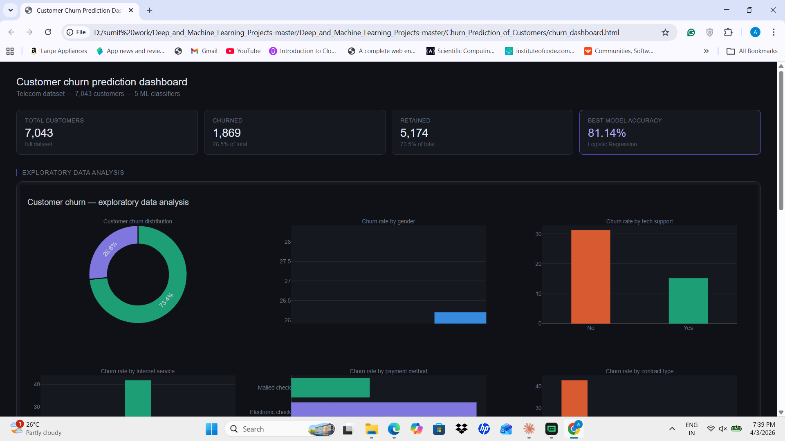

# Customer Churn Prediction

A machine learning project to predict customer churn for a telecom provider. The pipeline covers exploratory data analysis, preprocessing, training five classifiers, and generating an interactive dark-theme dashboard in a single HTML file.

---

## Demo

(preview3.png)

The output is a self-contained `churn_dashboard.html` with two interactive sections — an EDA overview and a model evaluation panel — built with Plotly.

---

## Dataset

**Telco Customer Churn** — 7,043 customers, 21 features.

| Column | Description |
|---|---|
| `customerID` | Unique customer identifier |
| `tenure` | Months with the company |
| `MonthlyCharges` | Monthly bill amount |
| `TotalCharges` | Total amount billed |
| `Churn` | Target — Yes / No |
| `Contract` | Month-to-month, one year, two year |
| `PaymentMethod` | Electronic check, mailed check, bank transfer, credit card |
| … | Other service flags (TechSupport, InternetService, etc.) |

Download the dataset from [Kaggle — Telco Customer Churn](https://www.kaggle.com/datasets/blastchar/telco-customer-churn) and place it in the project root as `Tel_Customer_Churn_Dataset.csv`.

---

## Project structure

```
customer-churn-prediction/
├── Customer_Churn_Prediction.py   # Main script
├── Tel_Customer_Churn_Dataset.csv # Dataset (download separately)
├── churn_dashboard.html           # Generated output dashboard
├── requirements.txt
└── README.md
```

---

## How it works

### 1. Preprocessing
- Maps `Churn` values (`Yes` / `No`) to integers (`1` / `0`) and casts to `int` to ensure numeric dtype.
- Replaces `"No internet service"` with `"No"` across service flag columns.
- Drops rows with missing `TotalCharges` values.
- One-hot encodes all categorical features and standard-scales continuous ones.

### 2. Exploratory data analysis
The EDA dashboard shows:
- Overall churn distribution (donut chart)
- Churn rate by gender, tech support, internet service, payment method, and contract type
- Churn rate vs. tenure scatter plot

### 3. Model training
Five classifiers are trained on a 70/30 train-test split:

| Model | Notes |
|---|---|
| Logistic Regression | Also used to generate per-customer churn probabilities |
| Support Vector Machine | Linear kernel — may take ~1 minute |
| K-Nearest Neighbor | k=5, Minkowski distance |
| Decision Tree | Gini impurity |
| Random Forest | 100 trees, entropy criterion |

### 4. Evaluation
The model evaluation panel shows:
- Horizontal bar chart comparing accuracy across all five models
- Confusion matrix (TP / TN / FP / FN) for the best-performing model

---

## Quickstart

**1. Clone the repo**
```bash
git clone https://github.com/your-username/customer-churn-prediction.git
cd customer-churn-prediction
```

**2. Install dependencies**
```bash
pip install -r requirements.txt
```

**3. Add the dataset**

Download `Tel_Customer_Churn_Dataset.csv` from Kaggle and place it in the project root.

**4. Run the script**
```bash
python Customer_Churn_Prediction.py
```

The script trains all models, prints accuracy scores to the terminal, and opens `churn_dashboard.html` in your default browser.

---

## Requirements

```
numpy
pandas
matplotlib
plotly
scikit-learn
```

Or install from the file:
```bash
pip install -r requirements.txt
```

---

## Results

Typical accuracy on this dataset (results may vary slightly by environment):

| Model | Accuracy |
|---|---|
| Logistic Regression | ~80% |
| Support Vector Machine | ~80% |
| K-Nearest Neighbor | ~77% |
| Decision Tree | ~73% |
| Random Forest | ~79% |

---

## Bug fix note

If you see `TypeError: Expected numeric dtype, got object instead`, add the following line after the `Churn` column mapping (around line 37):

```python
churn_dataset['Churn'] = churn_dataset['Churn'].astype(int)
```

This is required because assigning integers into a string-typed column does not automatically promote the dtype in pandas.

---

## License

This project is licensed under the MIT License. See [LICENSE](LICENSE) for details.
